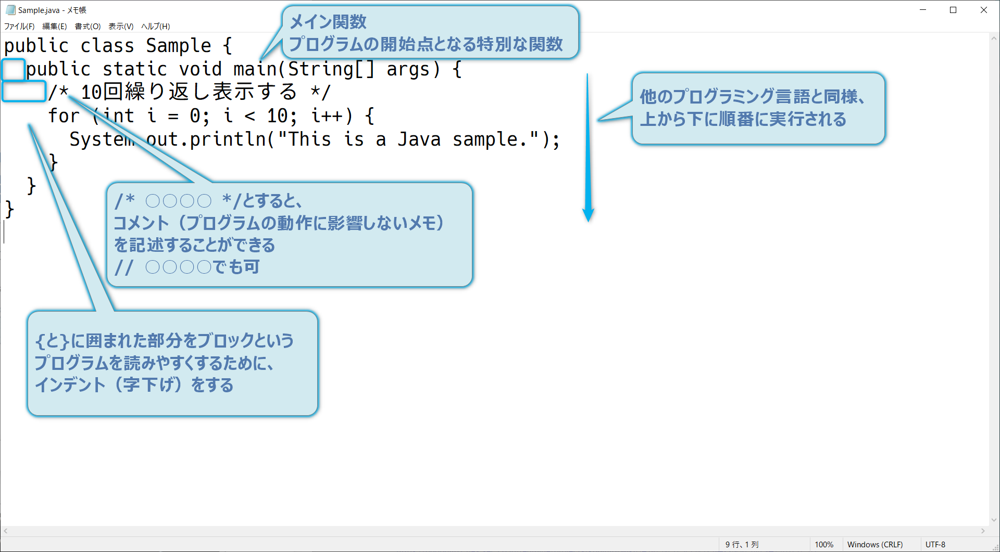
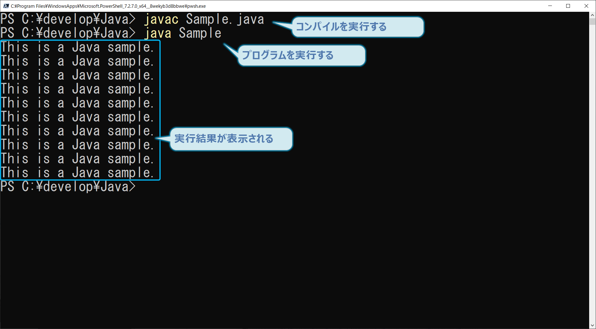

<!-- _class: title -->

# 基本構文

<!--
/div/■
基本構文■
■■
-->

---

<!-- _class: point -->

## 今回のポイント

- Javaプログラムの基本形
- コーディング規約

<!--
/div/■
今回のポイントです。■
Javaプログラムを作成するための基本形を説明します。■
また、プログラムの品質を上げるコーディング規約についても学習します。■
■■
-->

---

<!-- _class: contents -->
<!-- paginate: true -->

### Javaプログラムの基本形

<!--
/div/■
Javaプログラムの基本形■
メイン関数は、プログラムの開始点となる特別な関数です。■
他のプログラミング言語と同様に、原則として、上から下へ順番に実行されます。■
コメントを記述する場合は、先頭に/*▲末尾に*/を付けます。または、先頭に//を付けてもよいです。■
中括弧に囲まれた部分をブロックといい、プログラムを読みやすくするために、インデントという字下げをします。■
このページの例をメモ帳でプログラミングして、Sample.javaとして保存してください。■
■■
-->

---

<!--
/div/■
PowerShellを起動して、javac▲スペース▲Sample.java▲と入力して、コンパイルを実行してください。■
java▲スペース▲Sampleと入力して、プログラムを実行してください。■
実行結果として、同じ文が10回表示されます。■
■■
-->

---

### コーディング規約

コーディング規約とは、複数人での開発において全員が統一されたソースコードを書けるように定められたルールのことです。
（スタイルガイドと呼ばれることもあります。）

コーディング規約の主な目的は、個人の知識・技術の差を埋めて一定以上の品質や保守性を確保することです。
内容は、変数や関数などの命名規則、インデントやコメントの書き方、禁止事項などプロジェクトによって様々です。

Javaのコーディング規約としては、**Code Conventions for the Java Programming Language**や**Google Java Style Guide**などが有名です。

<!--
/div/■
コーディング規約■
コーディング規約とは、複数人での開発において全員が統一されたソースコードを書けるように定められたルールのことです。■
（スタイルガイドと呼ばれることもあります。）■
コーディング規約の主な目的は、個人の知識・技術の差を埋めて一定以上の品質や保守性を確保することです。■
内容は、変数や関数などの命名規則、インデントやコメントの書き方、禁止事項などプロジェクトによって様々です。■
Javaのコーディング規約としては、Code Conventions for the Java Programming LanguageやGoogle Java Style Guideなどが有名です。■
■■
-->

---

<!-- _class: point -->
<!-- paginate: false -->

## まとめ

- Javaプログラムの基本形
- コーディング規約

<!--
/div/■
まとめです。■
Javaプログラムを作成するための基本形を説明しました。■
また、プログラムの品質を上げるコーディング規約についても学習しました。■
■■
-->
